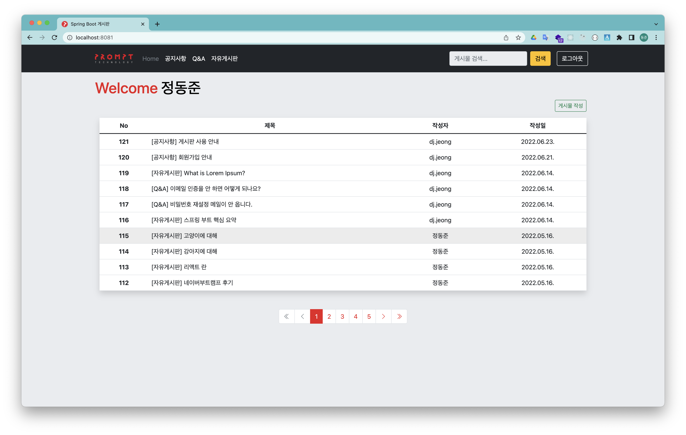
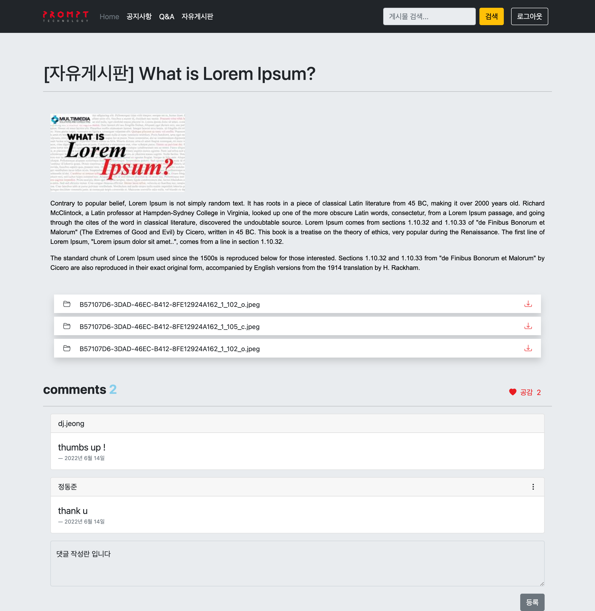

# [SB-Board]
> Spring Boot 게시판  [바로가기](https://sb-board.herokuapp.com/)

 

## Environment
* Java 11
* SprinBoot 2.6.7
* Mysql 8.0
* Spring-Data-JPA


## Configuration
* application.yml
    > application-sample.json을 복사하여 application-dev.json, application-test.json, application-prod.json 생성
* Intellij - Tyhmeleaf live reload
  1. application.yml 설정
    ```yaml
    #이미 설정되어 있음
    spring.thymeleaf.cache=false 
    ```
  2. Intellij - **Run > Edit Configurations**    
  > On 'Update': `Update classes and resources`      
  > On frame deactivation: `Update classes and resources`  
 
* profile (Intellij - **Run > Edit Configurations**)
  > * 개발 환경   
  > Active Profile: `dev`
  > * 테스트 환경   
  > Edit configuration templates... > JUnit > Environment variables: `SPRING_PROFILES_ACTIVE=test`

## Database Setting (Docker Mysql)
* [Docker 설치](https://www.docker.com/get-started/)
    ```shell
    # pull mysql 이미지
    docker pull --platform linux/amd64 mysql:latest
    # mysql 컨테이너 실행
    docker run --platform linux/amd64 -p 3306:3306 --name <컨테이너명> -e MYSQL_ROOT_PASSWORD=<root 패스워드> -d mysql:latest
    ```
* Database 생성
    ```mysql
    create database sbb;  
    create database `sbb-test`;  
    ```

## Sass
* [sass 설치](https://sass-lang.com/install)
* scss 컴파일: `sh run-sass-watch.sh`

## Build
* Intellij: 우측 상단 > Maven
  > Profiles > `prod` 선택    
  > sb-board > Lifecycle > install 클릭
* Mac terminal
    ```shell
    ./mvnw -Dspring.profiles.active=dev install
    ```

## Deploy
```shell
nohup java -jar -Dspring.profiles.active=prod ./target/sb-board-0.0.1-SNAPSHOT.jar &
```
